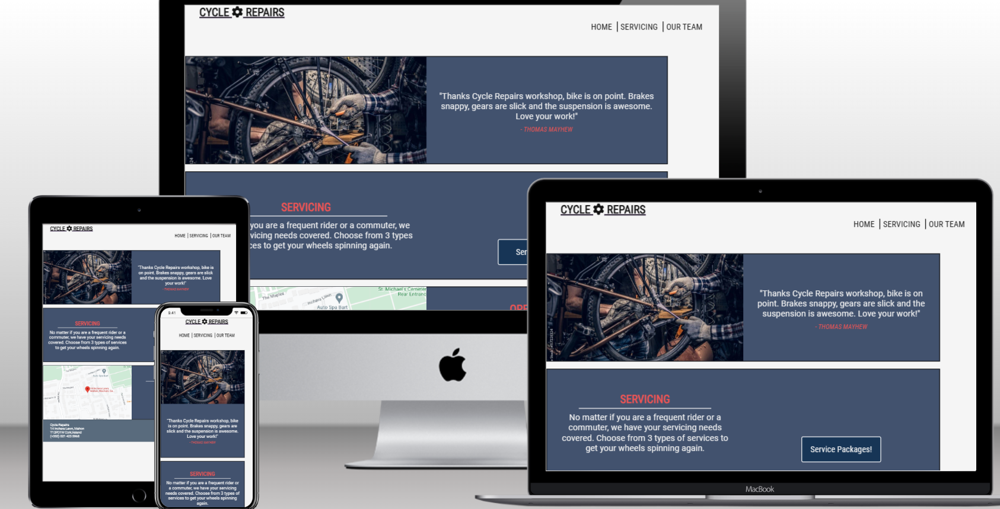

[Visit the deployed site](https://rayknezdev.github.io/cycle-repairs/) 

#  Cycle Repairs
This is a place where people can take their bicycles to have them repaired or serviced. Bicycle mechanics working at the shop can perform a wide range of repairs on bicycles, from fixing flat tires to adjusting brakes and gears. Bicycle repair shops may also offer services such as bike fitting, wheel building, and suspension tuning. We are specialy proud at our Instant-A Bit  Waiting,  service, where our mechanics,in short time could finish small road repairs, while customers waiting at our guest room with refreshments, and after allowed them to continue their ride.
## Project Description
 Bicycle Mechanic Shop project involve setting up a shop that specializes in repairing and servicing bicycles. The shop employ skilled bicycle mechanics who can perform a wide range of repairs and services on bicycles. The shop offer services such as bike fitting, wheel building, and suspension tuning, in addition to basic repairs like fixing flat tires and adjusting brakes and gears. We advice and educate owners and riders about maintenance and small home repairs.  The target audience for the shop is anyone who owns a bicycle and needs it to be repaired or serviced. This include casual riders, commuters, and competitive cyclists. The shop also sell bicycle parts and accessories to provide a one-stop-shop for all bicycle-related needs.
 ## Goals
Cycle Repairs ofer a wide range of products and services: In addition to bike sales, the shop could offer services, accessories, and parts installed by certified mechanics. Biking hats and apparel could also be available .
Target market: The shop could target a specific market such as university students or the surrounding population 
Exclusive dealer: The shop  aims to be the exclusive dealer for popular bike brands in a certain radius 
Location: The shop aim to be located in a prime location with good human and vehicular traffic 
Customer service: The shop  aim to provide excellent customer service.

 
 # Features:

 ### Navigation Bar

 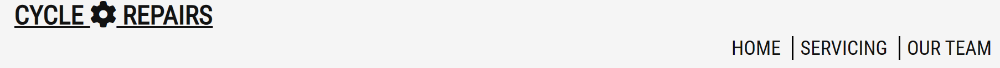

   - Responsive navigation bar includes links to the Logo, Home page, Servicing and Our Team
   - Section will allow the user to easily navigate from page to page across all devices without having to revert back to the previous page via the ‘back’ button. When howered it changes color.

### Footer

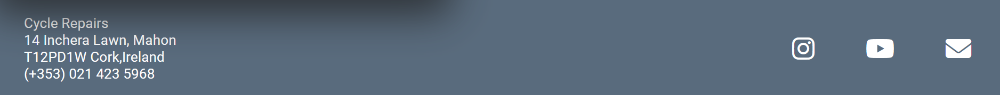
Footer is placed at botom of the page.It consists from contact adress and link to the social media

### Center
Presented with service link to second page where visitor can find information about service packages, their price and value.Working time sheet and interactive location map of the shop.

### Service page
After entering on second page user could find sort description about quality of fellows repairing jobs and Basic, Medium, Super package with prices and duration.

### Our team page
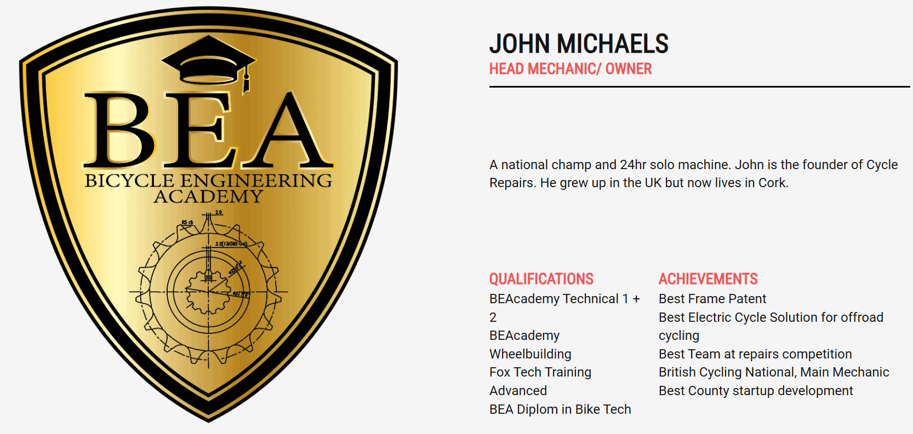
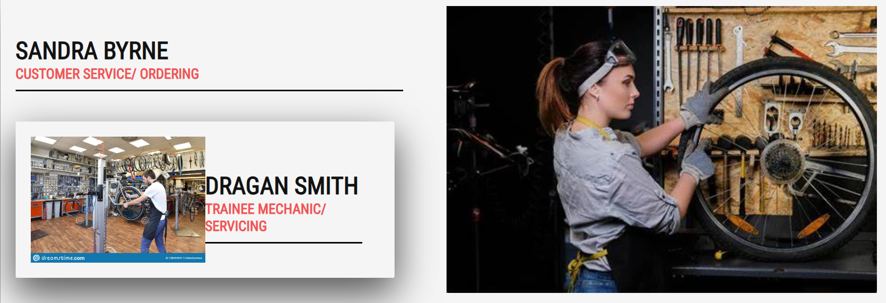
Third, Team page present other members of Cycle Repairs team, with nice logo of Bicycle Enginering Academy, state only body with educational program for future Bicycle Mechanics.

# User Stories
 - As a cyclist who needs regular maintenance and repairs for my bike, I want to be able to easily schedule appointments online so that I can quickly get my bike fixed  and 
    back on the road.
 - I want to be able to easily track the status  of my bike repairs online so that I can plan my schedule accordingly and to know when my bike is ready for pickup.           
 -  I want to be able to easily find the Cycle Repairs bicycle mechanic shop, so that I can quickly get my bike fixed and back oln the road.
 - Like regular customer, interested at long-time membership with discount repairs prices and discount prices on parts and new bicycles.
 - As a new user, I want to easily navigate on the website.
 - As a new user, I want to have an attractive presentations of the information about cycle repairing.
 - As a new user, I want to easily contact the cycle repair shop to book an appointment.
 - As a cyclist who needs regular maintenance and repairs for my bike, I want to be able to easily schedule appointments online so that I can quickly get my bike fixed and back on the road.
 - As a cyclist, I want to be able to easily track the status of my bike repairs online so that I can plan my schedule accordingly and to know when my bike is ready for pickup
 - As a cyclist, I want to be able to easily find the Cycle Repairs bicycle mechanic shop, so that I can quickly get my bike fixed and back on the road.
 

 
# Technologies Used
## Languages Used
HyperText Markup Language(HTML) and Cascading Style Sheet(CSS) were used to create this website.

[Github](https://www.github.com/) - To save and store the files for the website.

[Google Fonts](https://fonts.google.com/) - To import the fonts used on the website.

[Am I Responsive?](http://ami.responsivedesign.is/) To show the website image on a range of devices.

# Deployment
Github Pages was used to deploy the live website. The instructions to achieve this are below:

Log in (or sign up) to Github.com.
Find the repository for this project,rayknezdev/cycle-repairs
Click on the Settings link.
Click on the Pages link in the left hand side navigation bar.
In the Source section, choose main from the drop down select branch menu. Select Root from the drop down select folder menu.
Your live Github Pages site is now deployed at the URL shown.
## Local development

### How to Fork?
To fork the PP1 repository:

Log in (or sign up) to Github.
Go to the repository for this project, https://github.com/rayknezdev/cycle-repairs
Click the Fork button in the top right corner.

### How to Clone
To clone the PP1 repository:

Log in (or sign up) to GitHub.
Go to the repository for this project, https://github.com/rayknezdev/cycle-repairs
Click on the code button, select whether you would like to clone with HTTPS, SSH or GitHub CLI and copy the link shown.
Open the terminal in your code editor and change the current working directory to the location you want to use for the cloned directory.
Type 'git clone' into the terminal and then paste the link you copied in step 3. Press enter.
# Testing
On completion the site was tested across multiple browsers and platforms. The site has been built using Chrome, therefore it was also tested across Microsoft Edge and Firefox for desktops and larger screen sizes, whilst tested using Safari and Chrome on mobile and tablet devices.

- Screen Testing
The site was screen tested for reponsiveness locally using Chrome developer tools and also across real devices. These included:

- Desktops and Monitors
- Large HD desktop monitor
- Standard PC monitor
- Laptop Asus
- Phones and Tablets (landscape and portrait)
- iPhone Xr
- iPhone 11
- Huawei p30pro

# Bugs
- I had a problem at first deployment. Page localy was fine,at deployment was loosing images.Problem was in images organisations at image file. Extensions wasnt changed in the code.
- Logo at first page was small. Mistake was that  I put empty space between part of the code. Main page was running to the left laving white empty space. Procentage, "css" was less then should be  for the size of 10%.
- 

# Lighthouse Analysis
- Homepage
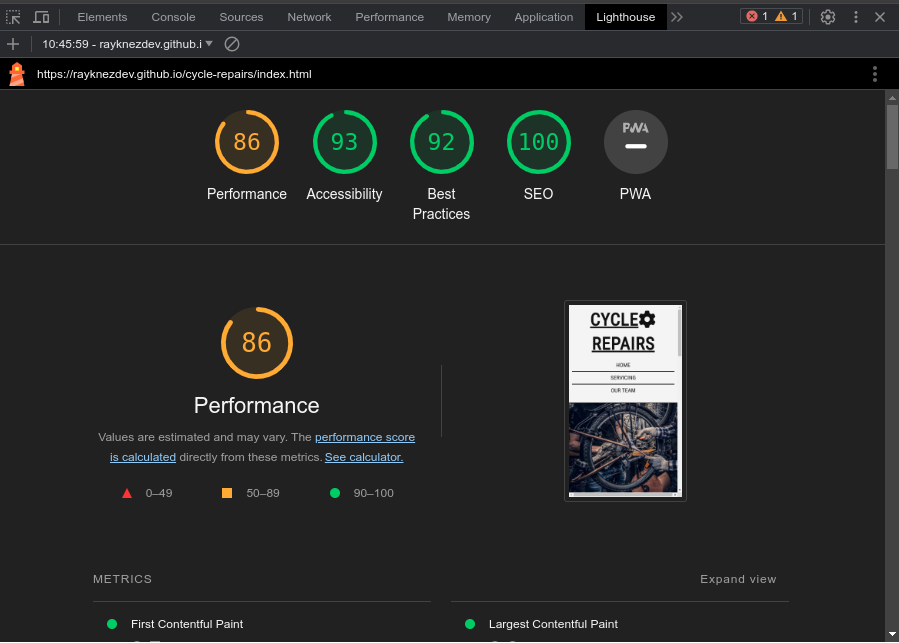

- Servicing
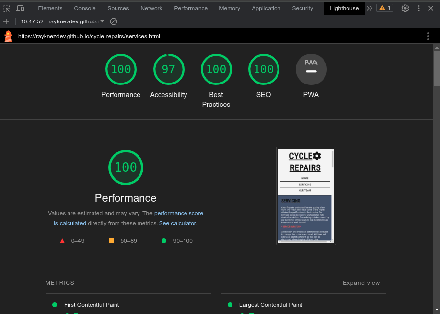

- Ourteam
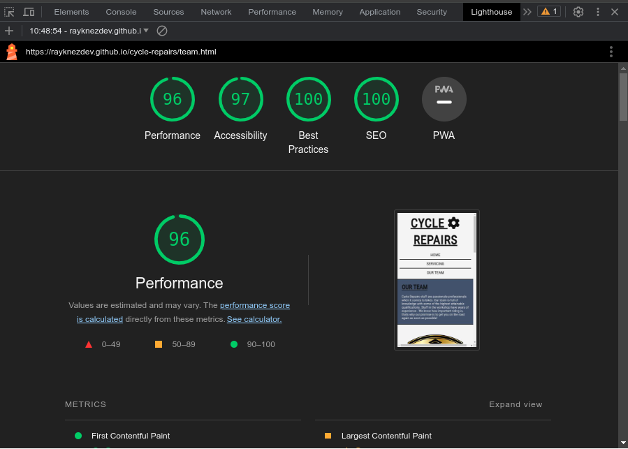

- Thankyou
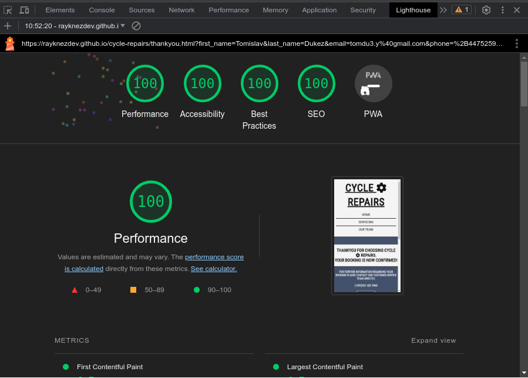

- Form
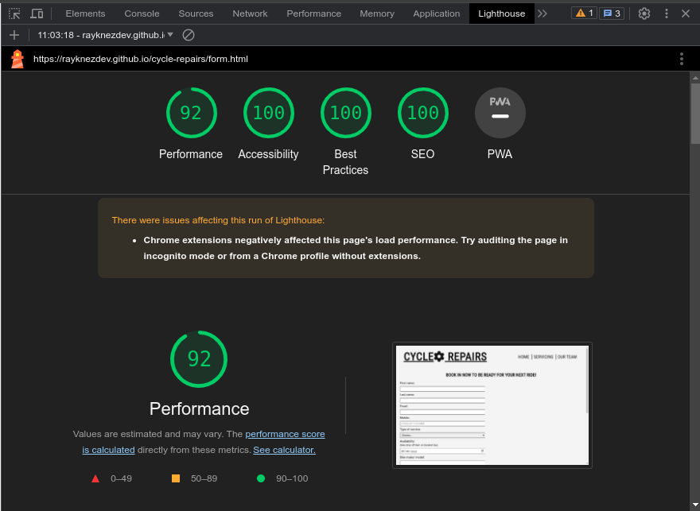

# Validation
## Html
-Mistakes were shown. Div element wasnt closed in several lines. That was corected
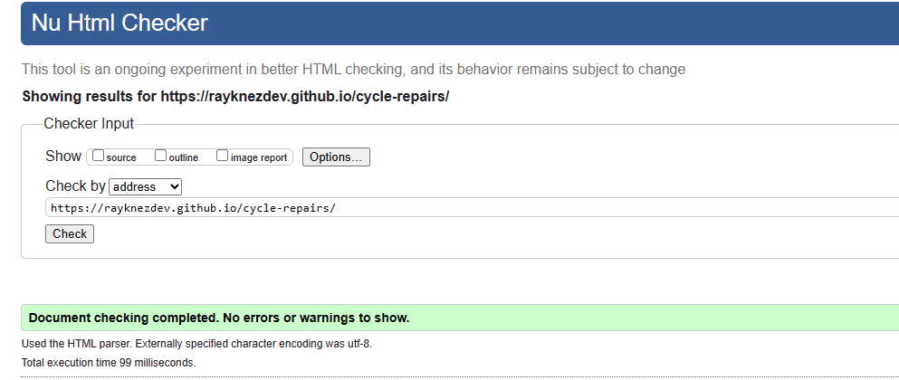

## Css
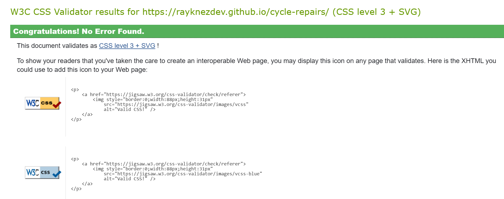

# Credits
## Content
- - Fonts

    Both fonts used (Roboto and Roboto Condensed) were taken from [Google Fonts](https://fonts.google.com/)

- Color Pallette

    Selected colors were chosen through this palette [Colorhunt](https://colorhunt.co/palette/f5f5f5f0545430475e121212)

- Hover Effects

    Inspiration and guidance for button and link hover effect came from multiple sources - [Free Frontend](https://freefrontend.com/css-hover-effects/), [W3 Schools](https://www.w3schools.com/cssref/sel_hover.php)

